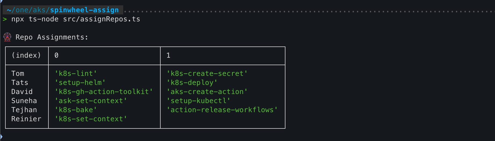

### **📜 README for Spin Wheel Repo Assignment Tool**  

---

## **🌀 Spin Wheel Repo Assignment Tool**
A simple **TypeScript-based spin wheel** to fairly assign repositories among a team of developers. This ensures unbiased distribution of weekly **dependabot merge jobs**.

---

## **📂 Repository List**
The tool will randomly assign work from the following repositories:
- `k8s-gh-action-toolkit`
- `ask-set-context`
- `k8s-set-context`
- `k8s-bake`
- `k8s-create-secret`
- `k8s-deploy`
- `k8s-lint`
- `setup-helm`
- `setup-kubectl`
- `aks-create-action`
- `action-release-workflows`

---

## **📦 Setup & Installation**

### **1️⃣ Clone the Repository**

```sh
git clone https://github.com/Tatsinnit/spinwheel-assign.git 
cd spinwheel-assign
```

### **2️⃣ Install Dependencies**
Ensure you have **Node.js** installed. Then run:
```sh
npm install
```

---

## **🚀 Running the Assignment Tool**
The tool randomly assigns repositories among `n` developers.

### **Run the script**
```sh
npm run assign
```
or manually using:
```sh
ts-node assignRepos.ts
```

### **Example Output**
```
Developer: Alice → [k8s-gh-action-toolkit, k8s-lint]
Developer: Bob → [k8s-bake, setup-helm]
Developer: Charlie → [k8s-set-context, aks-create-action]
...
```

---

## **🛠️ Building & Running**
To compile TypeScript into JavaScript:
```sh
npm run build
```
To run the compiled version:
```sh
node dist/assignRepos.js
```



---

## **📤 Pushing to GitHub**

After making changes:
```sh
git add .
git commit -m "Updated repo assignment logic"
git push origin main
```

---

## **📝 Contributing**
Feel free to submit **issues** or **pull requests** if you’d like to improve the tool!  

🚀 **Happy Coding!**